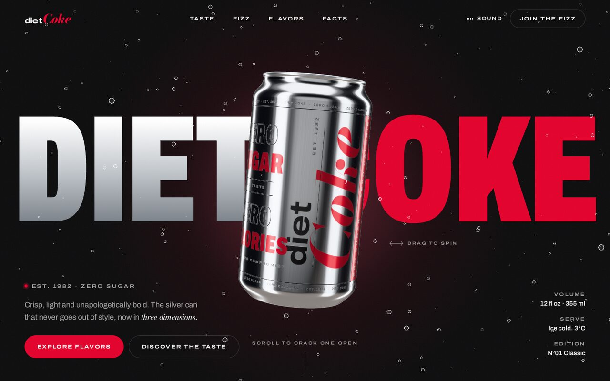
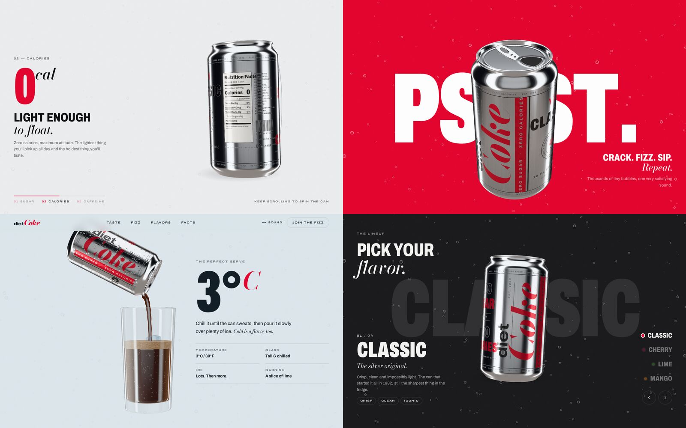

# Diet Coke — 3D Concept Website

An immersive, scroll-driven product website built around a fully procedural 3D Diet Coke can.
Scroll to spin the can through a product tour, crack it open, chill it and pour it over ice,
then pick a flavor. Grab the can at any time to spin it yourself.





> **Fan-made concept for learning purposes.** Not affiliated with, sponsored or endorsed by
> The Coca-Cola Company. Diet Coke and Coke are registered trademarks of The Coca-Cola Company.

## Highlights

- **A can made entirely in code.** No 3D model and no images: the body, shoulder, rim, domed base,
  pull tab and opening are lathed and extruded geometry, and the printed label is painted onto a
  canvas at runtime, together with a matching roughness/metalness map so the ink sits on real-looking
  brushed aluminium.
- **Studio lighting without HDR files.** A tiny virtual photo studio (softbox strips, rim lights, an
  overhead box) is rendered into a pre-filtered environment map, which gives the can those long
  vertical product-shot highlights.
- **Scroll storytelling.** Each chapter turns a different panel of the label to the camera:
  *zero sugar* → *nutrition facts* → *caffeine*. Then the tab lifts and the can pops open and
  sprays bubbles.
- **The pour.** Condensation beads on the can, a glass rises and ice drops in. The can tilts with
  its logo reading sideways and pours a stream of cola that arcs into the glass, and the drink
  rises with bubbles and a foam head. The stream is drawn along a curve in a shader, so it follows
  the can and the glass wherever the scroll moves them.
- **Drag to spin.** Grab the can in the hero, flavors and footer and flick it; it keeps spinning,
  then settles back to face you.
- **Flavor switcher.** Classic, Cherry, Lime and Mango. The can spins, its artwork is swapped mid-turn
  and the whole page re-themes. Works with buttons, arrow keys or a swipe.
- **Synthesised sound (optional).** Turn on *Sound* in the nav to hear the crack and fizz. It's
  generated live with the Web Audio API, so the project ships no audio files.
- **Details:** a preloader that fills the wordmark with liquid, smooth scrolling, masked text reveals, counters, a velocity-reactive marquee,
  magnetic buttons, a custom cursor, film grain and a dedicated mobile layout. With
  `prefers-reduced-motion`, the idle animation and smooth scrolling are turned off.

## Tech stack

| Purpose            | Library                                                     |
| ------------------ | ----------------------------------------------------------- |
| 3D rendering       | [three.js](https://threejs.org)                             |
| Animation & scroll | [GSAP](https://gsap.com) (ScrollTrigger, SplitText)         |
| Smooth scrolling   | [Lenis](https://lenis.darkroom.engineering)                 |
| Build tool         | [Vite](https://vite.dev)                                    |
| Fonts              | Archivo (variable width) & Bodoni Moda, self-hosted via Fontsource |

## Getting started

Requires **Node.js 20.19+ or 22.12+**.

```bash
cd diet-coke-3d
npm install
npm run dev       # http://localhost:5173
```

Production build:

```bash
npm run build     # outputs to dist/
npm run preview   # serves dist/ locally
```

`dist/` is a static site, so you can host it on GitHub Pages, Netlify, Vercel or any static
host. Asset paths are relative (`base: './'`), so it also works from a sub-folder.
Open it through a server (`npm run preview`) rather than double-clicking `index.html`.

### Single-file version (open without a server)

```bash
npm run build:single   # writes dist-single/diet-coke-3d.html
```

This creates one self-contained HTML file (about 1.4 MB) with the code, styles and fonts
embedded. Double-click it to open it in Chrome, Edge or Firefox. It works offline, and you can
pass the file to anyone without them installing anything.

## Project structure

```
diet-coke-3d/
├── index.html                  # all page content & sections
├── public/                     # favicon, social preview image
└── src/
    ├── main.js                 # boot sequence: fonts → 3D → loader → intro → scroll
    ├── data/flavors.js         # flavor lineup + page colour themes
    ├── styles/main.css         # design tokens, layout, responsive rules
    ├── webgl/
    │   ├── Experience.js       # renderer, camera, render loop, pointer parallax
    │   ├── Can.js              # can geometry, materials, tab & opening
    │   ├── textures.js         # label artwork, lid, condensation & shadow textures
    │   ├── environment.js      # virtual photo studio → environment map
    │   ├── Bubbles.js          # ambient carbonation + the opening spray
    │   ├── Glass.js            # glass, cola, foam head and bubbles
    │   ├── Stream.js           # the pour, a tube built along a curve in a shader
    │   ├── IceCubes.js         # ice dropped into the glass
    │   └── materials.js        # fake glass for the glass and ice

    ├── animations/
    │   ├── choreography.js     # the can's poses per chapter, driven by scroll
    │   └── reveal.js           # text reveals, counters, marquee
    └── ui/
        ├── loader.js, cursor.js, drag.js, flavors.js, sound.js
```

## How the scroll choreography works

`choreography.js` defines a **pose** for every chapter (position, rotation, scale, tab angle,
condensation, ice, bubbles and so on) and a list of scroll segments between them. Instead of
stacking many scrubbed tweens on one object, which breaks when you jump around the page, the
can's pose is **resolved from the scroll position every frame**. Each property follows its own
track of segments, so the result is always correct, whatever the scroll speed or direction and
after any resize.

To tweak the motion, edit the poses in `getStates()`. `x` and `y` are fractions of the half
viewport (`1` = right or top edge), and rotations are in radians.

## Customising

- **Flavors and colours:** `src/data/flavors.js`. The label artwork re-paints itself from these values.
- **Label design:** `drawLabel()` and friends in `src/webgl/textures.js`.
- **Lighting:** the softbox panels in `src/webgl/environment.js`.
- **Copy:** everything lives in `index.html`.
- **Social preview:** `og:image` points to `og-image.jpg` with a relative path. When you deploy,
  change it to the absolute URL so link previews can find it.
